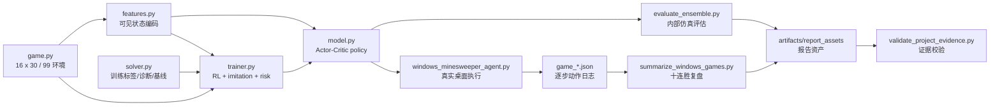

# 项目架构总览

本文档用于快速理解扫雷 RL 项目的系统边界、模块分工和证据链。更完整的实验叙述见 `PROJECT_REPORT.md`，最终模型输入输出和限制见 `MODEL_CARD.md`，checkpoint 与本地大体积产物说明见 `ARTIFACTS.md`。

## 一眼版

项目分成五层：

1. 仿真环境：`src/minesweeper_rl/game.py`
2. 可见状态编码：`src/minesweeper_rl/features.py`
3. RL 策略模型与训练器：`src/minesweeper_rl/model.py`、`src/minesweeper_rl/trainer.py`
4. 训练/诊断用 solver：`src/minesweeper_rl/solver.py`
5. 真实 Windows 执行与实验证据：`scripts/windows_minesweeper_agent.py`、`artifacts/report_assets`



## 决策边界

最终验证路径是纯 RL 决策：

```text
--solver-assist none --solver-safety-filter none
```

这意味着 solver 不参与最终决策。模型可以在训练期学习 solver 提供的 forced move、低风险 guess、mine/risk 辅助标签，也可以在失败复盘中接受 solver 对照诊断；但真实评估和 Windows 十连胜日志里的动作选择来自 RL checkpoint 或多个 RL checkpoint 的概率集成。

这个边界是项目最重要的研究定义：不是写一个传统扫雷 solver，而是研究 solver-guided RL 能否把逻辑先验内化到策略网络里。

## 内部仿真链路

内部环境用于大规模训练和稳定评估：

- `src/minesweeper_rl/game.py` 实现高级图规则、延迟布雷、首点安全、胜负判定和奖励。
- `src/minesweeper_rl/features.py` 只从玩家可见棋盘构造输入，不暴露真实雷图。
- `src/minesweeper_rl/model.py` 使用全卷积 Actor-Critic 网络，输出 `open / flag / unflag / chord` 四类动作。
- `src/minesweeper_rl/trainer.py` 负责 RL 更新、solver imitation、DAgger replay、mine auxiliary loss、risk supervision 和 checkpoint 管理。
- `scripts/evaluate_ensemble.py` 对一个或多个 checkpoint 做纯 RL 概率集成评估。

内部仿真的主要价值是快速比较策略质量，例如 `full_rlmix_20.pt + full_rlmix_100_best.pt` 在 1000 局中达到 `43.0%` 胜率。

## Solver 训练与诊断链路

`src/minesweeper_rl/solver.py` 是可见信息 solver，只基于当前玩家可见棋盘推理：

- 局部约束集合和 frontier 组件拆分。
- exact component enumeration。
- 全局剩余雷数概率估计。
- forced safe、forced mine 和低风险 guess 生成。

solver 的用途分三类：

- 训练：imitation / DAgger / risk supervision。
- 基线：估计纯逻辑策略的上界和稳定性。
- 诊断：在输局中判断模型是否错过 forced move、是否被错旗污染、残局全局计数是否不足。

这些用途都不改变最终评估的动作边界：solver 不参与最终决策。

## Windows 执行链路

`scripts/windows_minesweeper_agent.py` 把内部策略接到真实 Windows 扫雷窗口：

1. 捕获扫雷窗口或屏幕区域。
2. 检测 `16 x 30` 网格和格子中心。
3. 识别未开格、数字、空格、旗子、失败雷和胜负弹窗。
4. 将可见棋盘编码成模型输入。
5. 用 RL checkpoint 或 checkpoint ensemble 选择动作。
6. 对 open 动作移动鼠标、按下、抬起、移出棋盘。
7. 用快速单格读数或全盘读确认状态。
8. 保存每局 `game_*.json`，记录动作、读盘、点击和终局。

Windows 日志不仅记录胜负，还记录执行层异常，例如重复点击、未确认打开、读盘恢复、目标格偏移和终局弹窗。最新十连胜区间 `game_747.json` 到 `game_756.json` 中，这些执行异常为 0。

## 证据链

项目报告的数字来自本地实验 JSON，而不是手工填写：

- 内部评估：`artifacts/ensemble_20_100best_eval_1000_seed0.json`
- Windows 汇总：`artifacts/windows_agent/pure_rl_ensemble_20_100best_1000/per_game_summary.json`
- 十连胜逐局日志：`game_747.json` 到 `game_756.json`
- 报告资产：`artifacts/report_assets`
- 失败分析：`FAILURE_ANALYSIS.md`
- 产物哈希：`EXPERIMENT_MANIFEST.md`

校验脚本：

- `scripts/summarize_windows_games.py` 重算 Windows 胜率、最长连胜和十连胜区间。
- `scripts/generate_report_assets.py` 生成报告表格和 SVG。
- `scripts/summarize_failure_analysis.py` 生成 solver 对照失败分析。
- `scripts/validate_project_evidence.py` 校验报告数字、十连胜和执行层异常。
- `scripts/build_artifact_manifest.py` 生成关键产物 SHA-256。
- `scripts/validate_documentation.py` 校验文档入口、链接和测试数量。

## 面试讲法

可以把项目讲成三条线：

- 研究线：用 solver-guided RL 学习高级扫雷中的局部逻辑、全局剩余雷数和风险排序。
- 工程线：把策略接入真实 Windows GUI，解决识图、点击、焦点、终局检测和可审计日志。
- 证据线：用逐局 JSON、报告资产、哈希清单和自动校验证明胜率、十连胜和执行稳定性。

一句话版本：

> 我做的是一个高级扫雷强化学习系统：solver 只做训练 teacher 和诊断工具，最终动作由 Actor-Critic 策略网络或 RL checkpoint 集成决定；项目同时覆盖内部仿真、真实 Windows 执行层、十连胜日志和可复现证据校验。
